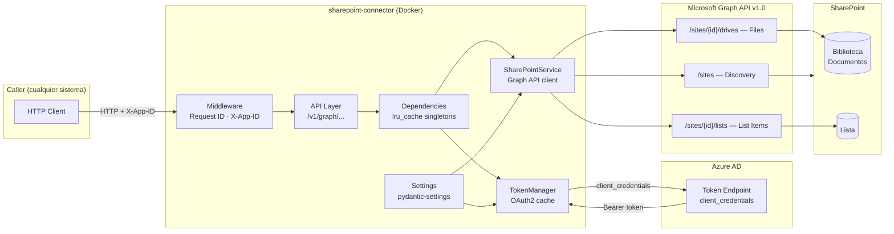
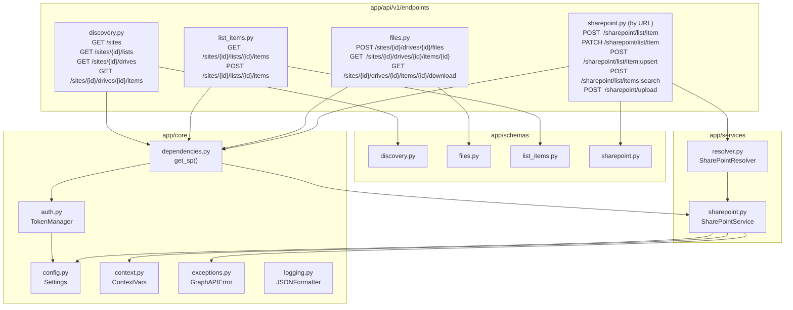
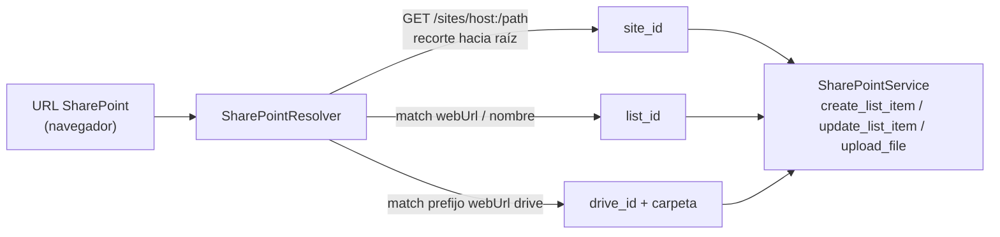
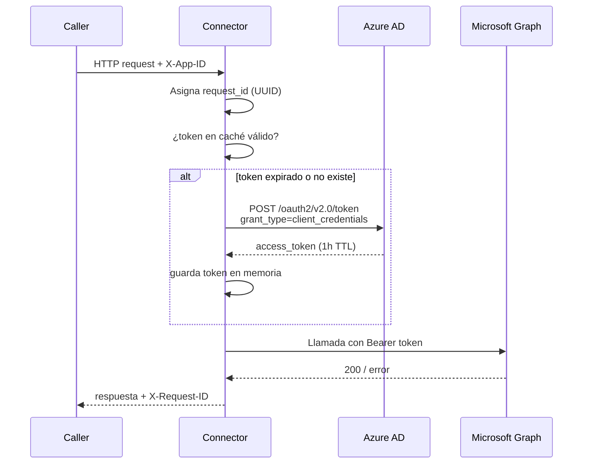

# Arquitectura: SharePoint Connector

**Versión:** 2.5.0  
**Fecha:** 2026-07-22  
**Autor:** Juan Camilo López Alzate — Latinia  

---

## 1. Contexto y motivación

La integración original entre **Jirito Newsletter** y **SharePoint** se realizaba a través de **Power Automate**, con dos limitaciones principales:

- Errores transitorios (408, 429, 5xx) no visibles en los logs, sin trazabilidad de fallos.
- Lógica de negocio fragmentada entre código y flujos visuales en plataforma externa.

**SharePoint Connector** elimina esta dependencia implementando la integración directamente sobre la **Microsoft Graph API**. La versión 2.0.0 amplía el alcance del servicio: en lugar de estar acoplado a un site concreto, expone una API genérica que opera sobre cualquier site, lista y biblioteca de documentos identificados dinámicamente en cada llamada.

---

## 2. Arquitectura actual



---

## 3. Componentes internos



### Descripción de módulos

| Módulo | Archivo | Responsabilidad |
|---|---|---|
| **FastAPI app** | `app/main.py` | Punto de entrada, middleware de logging, exception handlers |
| **Config** | `app/core/config.py` | Variables de entorno validadas con pydantic-settings |
| **TokenManager** | `app/core/auth.py` | Obtención y caché del token OAuth2 (client_credentials) |
| **Dependencies** | `app/core/dependencies.py` | Singletons inyectables via `lru_cache` (FastAPI DI) |
| **Exceptions** | `app/core/exceptions.py` | `GraphAPIError` y handlers de error para FastAPI |
| **Logging** | `app/core/logging.py` | `JSONFormatter` para logs estructurados en JSON |
| **Context** | `app/core/context.py` | `ContextVar`s para `request_id` y `client_app_id` |
| **Router v1** | `app/api/v1/router.py` | Agrupador de endpoints bajo prefijo `/v1` |
| **Discovery** | `app/api/v1/endpoints/discovery.py` | Endpoints de exploración (sites, listas, drives, carpetas) |
| **List Items** | `app/api/v1/endpoints/list_items.py` | Lectura y creación de ítems en listas |
| **Files** | `app/api/v1/endpoints/files.py` | Subida, metadata y descarga de archivos |
| **SharePoint (by URL)** | `app/api/v1/endpoints/sharepoint.py` | Endpoints orientados a usuario: crear / actualizar / *upsert* / búsqueda multi-campo de ítems y subir archivo a partir de una URL |
| **Schemas** | `app/schemas/` | Modelos Pydantic de request/response por dominio |
| **SharePointService** | `app/services/sharepoint.py` | Cliente HTTP de Graph API (GET, POST, PATCH, PUT, descarga, búsqueda y actualización de ítems, resolución de site, esquema de columnas con caché TTL) |
| **Period** | `app/services/period.py` | Traducción del `period` del upsert (atajo con nombre o rango explícito) a un intervalo UTC, calculado en la zona horaria del tenant |
| **SharePointResolver** | `app/services/resolver.py` | Traducción de URLs de SharePoint a `site_id`/`list_id`/`drive_id`+carpeta |

---

## 4. API

El conector expone dos niveles de API bajo `/v1`:

- **`/v1/sharepoint`** — orientada a usuario. El caller pasa la **URL de SharePoint** y el conector resuelve internamente los identificadores de Graph mediante `SharePointResolver`.
- **`/v1/graph`** — de bajo nivel. Opera con `site_id`/`list_id`/`drive_id` explícitos (obtenidos vía discovery).

### Capa de resolución de URL (`SharePointResolver`)

`SharePointResolver` traduce una URL "humana" de SharePoint a los identificadores que Graph necesita:

1. **Site:** se intenta `GET /sites/{host}:/{path}` con la ruta de la URL y, ante un `404`, se recorta el último segmento y se reintenta hacia la raíz. El primer path que resuelve es el *web* más profundo que contiene el recurso. Cubre de forma uniforme la raíz, managed paths (`/Oper`), `/sites/{x}`, `/teams/{x}` y subsites anidados. Los IDs de site resueltos se cachean (son estables).
2. **Lista** (`POST`, `PATCH`, `POST .../list/item:upsert` y `POST .../list/items:search`): se localiza el segmento tras `/Lists/` y se empareja contra las listas del site por `webUrl` (coincidencia exacta) con fallback a `displayName`/`name`. La misma resolución sirve para crear (`POST`), actualizar (`PATCH`), el upsert y la búsqueda.
3. **Biblioteca y carpeta** (`POST /v1/sharepoint/upload`): la carpeta destino se toma del parámetro `?id=` (ruta servidor) o de la propia ruta sin la página de formulario. La biblioteca es el drive cuyo `webUrl` es el prefijo más largo de esa ruta; el resto es la carpeta destino (que se crea automáticamente al subir).



### SharePoint (por URL)

#### `POST /v1/sharepoint/list/item`

Inserta un ítem en la lista identificada por su URL.

**Request:**
```json
{
  "sharepoint_url": "https://host.sharepoint.com/Oper/Lists/Incidencias/View.aspx",
  "data": { "Title": "LATSUP-6585", "Prioridad": "Alta" }
}
```

> Las claves de `data` son los **nombres internos** de las columnas (igual que `fields` en `/v1/graph`).

**Response 201:**
```json
{ "status": "created", "id": "42", "webUrl": "https://...", "site_id": "...", "list_id": "..." }
```

#### `PATCH /v1/sharepoint/list/item`

Actualiza un ítem existente de la lista identificada por su URL. El registro a modificar se localiza con `filter_by` (`field` + `value`), que debe identificar un **único** ítem: el conector lo busca vía Graph para obtener su `id` interno y después aplica `data`.

**Request:**
```json
{
  "sharepoint_url": "https://host.sharepoint.com/Oper/Lists/Incidencias/View.aspx",
  "filter_by": { "field": "_x006c_dq4", "value": "LATSUP-0000" },
  "data": { "Title": "Actualización", "y4ap": "Baja", "Atendida": false }
}
```

> Tanto `filter_by.field` como las claves de `data` son los **nombres internos** de las columnas. `filter_by.value` se trata como texto.

La búsqueda usa `GET .../items?$expand=fields&$filter=fields/{field} eq '{value}'` con la cabecera `Prefer: HonorNonIndexedQueriesWarningMayFailRandomly` (las columnas custom no suelen estar indexadas). La actualización es `PATCH .../items/{id}/fields` con el conjunto de campos sin envolver.

| Resultado de `filter_by` | Respuesta |
|---|---|
| 1 coincidencia | `200` — ítem actualizado |
| 0 coincidencias | `404` — ningún registro coincide |
| > 1 coincidencia | `409` — el filtro no es único; no se modifica nada |

**Response 200:**
```json
{ "status": "updated", "id": "7", "webUrl": "https://...", "site_id": "...", "list_id": "..." }
```

#### `POST /v1/sharepoint/list/item:upsert`

*Upsert* genérico (verificar-y-decidir): inserta o actualiza según una coincidencia por **clave** y, opcionalmente, **periodo**. No hay nada de dominio quemado — la columna clave, la de fecha y el esquema de `data` viajan en el payload, de modo que el mismo endpoint sirve a **cualquier lista**.

**Request:**
```json
{
  "sharepoint_url": "https://host.sharepoint.com/Oper/Lists/Incidencias/View.aspx",
  "match": {
    "key_field": "TicketId",
    "key_value": "INC-12345",
    "date_field": "Created",
    "period": "current_month"
  },
  "data": { "Title": "Incidencia", "Estado": "Resuelto" }
}
```

El filtro combina con `and`: igualdad exacta sobre `key_field` y, si se indica `date_field` + `period`, un rango `fields/{date_field} ge '{inicio}' and ... lt '{fin}'`. `period` admite un **atajo con nombre** (`current_day`, `current_week`, `current_month`, `current_year`) o un **rango explícito** `{ "from": "YYYY-MM-DD", "to": "YYYY-MM-DD" }` (con `to` inclusive). Los límites se calculan en la **zona horaria del tenant** (`TENANT_TIMEZONE`) y se convierten a UTC para el `$filter` (`app/services/period.py`). Sin `period`/`date_field`, la coincidencia es solo por clave; indicar `period` sin `date_field` se rechaza con `422`.

| Coincidencias | Desenlace |
|---|---|
| 0 | `create_list_item` → `result="created"` |
| 1 | `update_list_item` sobre ese ítem → `result="updated"` |
| > 1 | se actualiza el **primero**, `result="updated"` y `warning` en logs (no `409`) |

**Response 200:**
```json
{ "result": "updated", "id": "7", "webUrl": "https://...", "site_id": "...", "list_id": "...", "matched": 1 }
```

> A diferencia del `PATCH`, varias coincidencias **no** son error: la decisión de negocio es actualizar la primera y emitir un `warning` para detectar duplicados preexistentes.

#### `POST /v1/sharepoint/list/items:search`

Búsqueda de ítems con hasta **15 condiciones de igualdad combinadas con AND**, validadas contra el esquema real de la lista. Generaliza el filtro clave+fecha del upsert a N campos con valores **tipados**.

**Request:**
```json
{
  "sharepoint_url": "https://host.sharepoint.com/Oper/Lists/DSL/Allitemsg.aspx",
  "filters": [
    { "field": "Entorno", "value": "L02" },
    { "field": "_x00da_ltima", "value": true }
  ],
  "order_by": { "field": "Created", "direction": "desc" },
  "top": 100
}
```

`filters`, `order_by` y `top` son opcionales; sin `filters` (u `[]`) se devuelven los primeros `top` ítems sin filtrar. El request usa `extra="forbid"`: cualquier campo desconocido (p. ej. un `filter_by` de otros endpoints) → `422`, nunca ignorado en silencio.

**Traducción de valores a literal OData** (interna, invisible para el caller):

| Tipo JSON de `value` | Literal OData | Nota |
|---|---|---|
| string | `'texto'` (comillas internas duplicadas: `'O''Hara'`) | igual que el resto de endpoints |
| boolean | **`1` / `0`** — nunca `true`/`false` | Graph **ignora en silencio** `eq true\|false` (y `eq 'true'`) sobre columnas Sí/No: devuelve todas las filas sin error. `eq 1`/`eq 0` sí filtra. Verificado empíricamente contra la lista DSL (2026-07-22). |
| entero / decimal | literal sin comillas | |

**Validación contra el esquema de columnas** (anti-"ignorado en silencio"): antes de construir el `$filter`, el conector consulta `GET /sites/{id}/lists/{id}/columns` — cacheado por `(site_id, list_id)` con **TTL de 300 s** (a diferencia del caché de sites, sin caducidad, porque las columnas pueden cambiar) — y valida cada condición:

| Condición | Respuesta |
|---|---|
| Campo inexistente en la lista | `400` nombrando el campo |
| Tipo JSON ≠ tipo de columna (string contra Sí/No, texto contra numérica, …) | `400` explicando el tipo esperado (sin coerción) |
| Columna lookup referenciada por su nombre base | `400` — debe usarse `{Columna}LookupId` con el ID numérico |
| `{Columna}LookupId` de una columna lookup | aceptado, tipo esperado: entero |
| Valor bien tipado que no coincide con ninguna fila | `200` con `total: 0` (no es error) |

La expresión completa se percent-encodea y se envía con `Prefer: HonorNonIndexedQueriesWarningMayFailRandomly`; los nombres de campo se validan contra `[A-Za-z0-9_]+` en doble capa (schema `422` + servicio `400`, anti-inyección OData).

**`order_by`** → `$orderby=fields/{field} asc|desc`. **Limitación conocida:** en listas que superan el umbral de vista de SharePoint (~5000 filas), Graph responde `notSupported` al ordenar por columnas no indexadas; el error se propaga con su detalle. Recomendación: ordenar por columnas indexadas (`Created`, `Modified`, `ID`).

**`top`** (1–5000, default 100): Graph trata `$top` como tamaño de página, no como límite total, así que el conector sigue `@odata.nextLink` solo hasta reunir `top` ítems y trunca el excedente. `has_more: true` indica que el corte dejó fuera filas coincidentes. (Paginación por cursor: evaluada y pospuesta conscientemente; añadirla después es retrocompatible.)

**`select`** (v2.5.0, opcional, hasta 50 nombres) → `$expand=fields($select=Col1,Col2,...)`: proyecta el `fields` de cada ítem a solo esas columnas. Cada nombre se valida en doble capa (`[A-Za-z0-9_]+` → `422`; contra el esquema real de columnas → `400` si no existe, porque Graph ignora en silencio los nombres desconocidos en `$select`). **Asimetría deliberada con los filtros:** en `select` las columnas lookup admiten ambas formas — el nombre base proyecta el valor visible y `{Columna}LookupId` el ID numérico — mientras que en `filters` el nombre base se rechaza (filtrar por él es poco fiable en Graph). Omitido o `[]` → todos los campos. Graph puede añadir claves de sistema (p. ej. `@odata.etag`) dentro de `fields` aun con proyección.

**Response 200:**
```json
{ "total": 2, "items": [ { "id": "7", "webUrl": "https://...", "fields": { "Entorno": "L02", "_x00da_ltima": true } } ],
  "has_more": false, "site_id": "...", "list_id": "..." }
```

#### `POST /v1/sharepoint/upload`

Sube un archivo a la biblioteca/carpeta identificada por su URL. Cuerpo `multipart/form-data` con `sharepoint_url` y `file`.

**Response 201:**
```json
{ "status": "uploaded", "id": "01ABC...", "name": "TAM.txt", "size": 2048,
  "webUrl": "https://...", "site_id": "...", "drive_id": "...", "folder": "Areas/Advisors/OnlyTest" }
```

---

### Discovery

> Los endpoints de discovery, list items y files siguientes están bajo `/v1/graph` y operan con identificadores explícitos.

#### `GET /v1/graph/sites`

Lista todos los sites de SharePoint accesibles por la aplicación.

| Query param | Tipo | Default | Descripción |
|---|---|---|---|
| `search` | string | `*` | Palabra clave para filtrar por nombre o URL |

**Response 200:**
```json
{
  "sites": [
    { "id": "hostname,site-col-id,site-id", "name": "soporte", "displayName": "Soporte", "webUrl": "https://..." }
  ],
  "total": 1
}
```

---

#### `GET /v1/graph/sites/{site_id}/lists`

Lista todas las listas del site (incluidas listas de sistema).

**Response 200:**
```json
{
  "site_id": "...",
  "lists": [
    { "id": "uuid", "name": "Análisis Soporte", "displayName": "Análisis Soporte", "webUrl": "https://..." }
  ],
  "total": 1
}
```

---

#### `GET /v1/graph/sites/{site_id}/drives`

Lista las bibliotecas de documentos (drives) del site.

**Response 200:**
```json
{
  "site_id": "...",
  "drives": [
    { "id": "b!...", "name": "Documents", "driveType": "documentLibrary", "webUrl": "https://..." }
  ],
  "total": 1
}
```

---

#### `GET /v1/graph/sites/{site_id}/drives/{drive_id}/items`

Navega el árbol de carpetas y archivos de un drive.

| Query param | Tipo | Default | Descripción |
|---|---|---|---|
| `item_id` | string | null | ID de carpeta a listar. Omitir para listar la raíz |

**Response 200:**
```json
{
  "drive_id": "b!...",
  "parent_id": null,
  "items": [
    { "id": "...", "name": "DailyDelivery", "is_folder": true, "size": null, "webUrl": "..." }
  ],
  "total": 1
}
```

---

### List Items

#### `GET /v1/graph/sites/{site_id}/lists/{list_id}/items`

Lee ítems de una lista junto con sus valores de campo.

| Query param | Tipo | Default | Descripción |
|---|---|---|---|
| `top` | int | `20` | Número máximo de ítems a devolver (1–5000) |

**Response 200:**
```json
{
  "site_id": "...",
  "list_id": "...",
  "items": [
    { "id": "1", "fields": { "Title": "LATSUP-001", "organization": "Acme" }, "webUrl": "..." }
  ],
  "total": 1
}
```

---

#### `POST /v1/graph/sites/{site_id}/lists/{list_id}/items`

Inserta un nuevo ítem en la lista.

**Request:**
```json
{
  "fields": {
    "Title": "LATSUP-6585",
    "organization": "Acme Corp",
    "score": 9.5,
    "resolved": true
  }
}
```

> Los nombres de campo deben ser los **nombres internos** (internal name) de las columnas en SharePoint, no el nombre de visualización.

**Response 201:**
```json
{ "status": "created", "id": "42", "webUrl": "https://..." }
```

---

### Files

#### `POST /v1/graph/sites/{site_id}/drives/{drive_id}/files`

Sube un archivo a una biblioteca de documentos. El cuerpo es `multipart/form-data`.

| Query param | Tipo | Default | Descripción |
|---|---|---|---|
| `folder` | string | `""` | Subcarpeta destino (p.ej. `Areas/testing_empty/OnlyTest`) |

La carpeta se crea automáticamente si no existe.

**Response 201:**
```json
{
  "status": "uploaded",
  "id": "01ABC...",
  "name": "informe.json",
  "size": 2048,
  "webUrl": "https://...",
  "drive_path": "/drive/root:/DailyDelivery"
}
```

---

#### `GET /v1/graph/sites/{site_id}/drives/{drive_id}/items/{item_id}`

Devuelve metadatos de un archivo o carpeta.

**Response 200:**
```json
{
  "id": "01ABC...",
  "name": "informe.json",
  "size": 2048,
  "webUrl": "https://...",
  "mime_type": "application/json",
  "created_at": "2026-06-01T10:00:00Z",
  "modified_at": "2026-06-09T08:30:00Z",
  "download_url": "https://...pre-authenticated-url..."
}
```

El campo `download_url` es una URL pre-autenticada válida ~1 hora (sin token Bearer).

---

#### `GET /v1/graph/sites/{site_id}/drives/{drive_id}/items/{item_id}/download`

Descarga el contenido binario del archivo.

**Response 200:** bytes del archivo con `Content-Type` del MIME real y `Content-Disposition: attachment; filename="..."`.

---

### Health

#### `GET /health`

```json
{ "status": "ok", "service": "SharePoint Connector", "version": "2.3.0" }
```

---

### Cabeceras HTTP

| Cabecera | Dirección | Descripción |
|---|---|---|
| `X-App-ID` | Request | Identificador del caller. Se registra en todos los logs |
| `X-Request-ID` | Response | UUID generado por el middleware para trazabilidad |

### Códigos de error

| Código | Causa |
|---|---|
| `400` | Parámetro inválido o faltante |
| `401` | Fallo de autenticación con Microsoft Graph |
| `403` | Permisos insuficientes (site sin grant, permisos Graph incorrectos) |
| `404` | Recurso no encontrado en SharePoint (incluye `filter_by` sin coincidencias en `PATCH /v1/sharepoint/list/item`) |
| `409` | Conflicto: `filter_by` coincide con más de un registro en `PATCH /v1/sharepoint/list/item` |
| `429` | Rate limit de Microsoft Graph — reintentar más tarde |
| `500` | Error interno no controlado |
| `502` | Error inesperado devuelto por Microsoft Graph |

---

## 5. Autenticación y seguridad



### Modelo de permisos: `Sites.Read.All` / `Sites.ReadWrite.All`

El App Registration en Azure AD requiere los permisos de aplicación:

- **`Sites.Read.All`** — para discovery y lectura de listas/archivos.
- **`Sites.ReadWrite.All`** — para escritura (crear ítems, subir archivos).

Como alternativa más restrictiva se puede usar **`Sites.Selected`**, que limita el acceso a sites específicos. En ese caso, un administrador debe conceder acceso explícitamente:

```powershell
Connect-PnPOnline -Url "https://latinia.sharepoint.com" -Interactive

Grant-PnPAzureADAppSitePermission `
  -AppId "<CLIENT_ID>" `
  -DisplayName "SharePoint Connector" `
  -Site "https://latinia.sharepoint.com/sites/yoursite" `
  -Permissions Write
```

Si el grant no está concedido, Graph devuelve `403 Forbidden` — visible en los logs del conector con `request_id`.

---

## 6. Logging estructurado

Todos los logs se emiten en JSON por `stdout`, compatibles con cualquier stack de observabilidad (ELK, Loki, CloudWatch, etc.).

```json
{
  "timestamp": "2026-06-09T10:00:00.000Z",
  "level": "INFO",
  "logger": "app.services.sharepoint",
  "message": "Uploaded file 'informe.json' (2048 bytes) → drive b!... / site hostname,...",
  "module": "sharepoint",
  "function": "upload_file",
  "line": 167,
  "request_id": "a1b2c3d4-...",
  "client_app_id": "jirito-newsletter",
  "site_id": "hostname,...",
  "drive_id": "b!...",
  "file_name": "informe.json"
}
```

Campos estructurados disponibles: `request_id`, `client_app_id`, `method`, `path`, `status_code`, `duration_ms`, `site_id`, `list_id`, `drive_id`, `item_id`, `file_name`, `graph_url`, `graph_status`.

---

## 7. Despliegue

### Variables de entorno

| Variable | Requerida | Descripción | Ejemplo |
|---|---|---|---|
| `TENANT_ID` | Sí | ID del tenant Azure AD | `xxxxxxxx-...` |
| `CLIENT_ID` | Sí | ID del App Registration | `xxxxxxxx-...` |
| `CLIENT_SECRET` | Sí | Secreto del App Registration | `abc123~...` |
| `LOG_LEVEL` | No | Nivel de log (`DEBUG`/`INFO`/`WARNING`/`ERROR`) | `INFO` |
| `TENANT_TIMEZONE` | No | Zona horaria IANA del tenant para acotar periodos del upsert | `UTC` / `Europe/Madrid` |
| `SP_PORT` | No | Puerto expuesto en el host | `8003` |

> La API opera siempre con `site_id`, `list_id` y `drive_id` pasados como path params en cada llamada. Obtener estos IDs es el primer paso mediante los endpoints de discovery.

### Arranque con Docker Compose

```bash
cp devops/.env.example devops/.env
# Editar devops/.env con los valores reales
docker compose -f devops/docker-compose.yml up -d --build
```

### Integración en una red Docker existente

```yaml
# docker-compose.yml del caller (p.ej. Jirito Newsletter)
services:
  app:
    networks:
      - sp-net

  sharepoint-connector:
    image: sharepoint-connector:latest
    env_file: .env.sp-connector
    networks:
      - sp-net

networks:
  sp-net:
    driver: bridge
```

El caller apunta a `http://sharepoint-connector:8003/v1/graph/...`.

---

## 8. Flujo típico de uso

```
1. GET /v1/graph/sites?search=soporte
   → obtener site_id

2. GET /v1/graph/sites/{site_id}/lists
   → obtener list_id

3. GET /v1/graph/sites/{site_id}/drives
   → obtener drive_id

4. POST /v1/graph/sites/{site_id}/lists/{list_id}/items
   → crear ítem en lista

5. POST /v1/graph/sites/{site_id}/drives/{drive_id}/files?folder=DailyDelivery
   → subir archivo (multipart/form-data)

6. GET /v1/graph/sites/{site_id}/drives/{drive_id}/items/{item_id}/download
   → descargar archivo
```

Los IDs de site, lista y drive son estables; solo es necesario hacer discovery una vez y cachear los resultados en el caller.

---

## 9. Comparativa con versión anterior (v1)

| Aspecto | v1.0.0 | v2.0.0 |
|---|---|---|
| **Endpoints** | `POST /upload`, `POST /list` | API REST versionada `/v1/graph/...` con 9 endpoints |
| **Scope** | Site único fijo (env var `SITE_URL`) | Multi-site dinámico — site/lista/drive en cada llamada |
| **Discovery** | No disponible | Endpoints para explorar sites, listas, drives y carpetas |
| **Subida de archivos** | JSON con `data` en Base64 | `multipart/form-data` — más eficiente y estándar |
| **Descarga de archivos** | No disponible | `GET .../download` — bytes directos con Content-Type |
| **Metadatos de archivo** | No disponible | `GET .../items/{item_id}` con `download_url` pre-autenticada |
| **Logging** | Básico | JSON estructurado con `request_id`, `client_app_id`, duración |
| **Trazabilidad** | Parcial | `X-Request-ID` en respuesta + contexto propagado a services |
| **Manejo de errores** | Genérico | `GraphAPIError` tipado con códigos 400/401/403/404/429/502 |
| **Estructura de módulos** | Plana (`app/*.py`) | Capas separadas: `core/`, `api/v1/`, `schemas/`, `services/` |

---

## 10. Limitaciones conocidas (v2)

| Limitación | Condición | Solución futura |
|---|---|---|
| Tamaño máximo de archivo | 4 MB (límite de `PUT .../content` en Graph) | Implementar upload sessions para archivos mayores |
| Sin paginación en discovery | Resultados truncados si hay >1000 sites/listas/drives | Implementar `@odata.nextLink` |
| Sin cola de reintentos | Fallo en Graph → error inmediato al caller | Añadir cola interna con reintentos exponenciales |
| Sin autenticación entre caller y conector | El servicio confía en cualquier caller en la red | Añadir API key o JWT en cabecera `X-Api-Key` |
| Token en memoria (no distribuido) | Una sola instancia — token no compartido entre réplicas | Externalizar caché de token (Redis) para alta disponibilidad |
